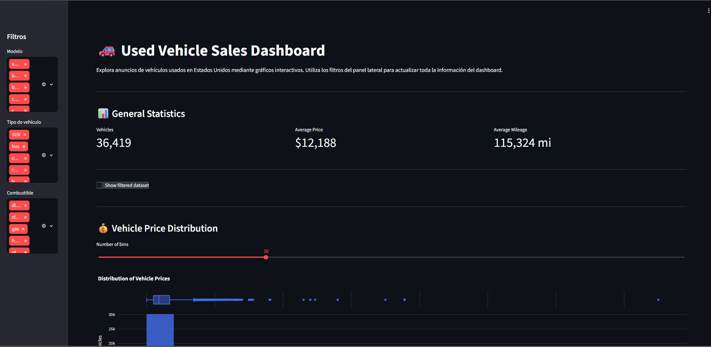

# ***Sprint 7 Project: Streamlit.*** 🚗 

### ***_Primera Visualizacion de la Aplicacion_***

### 📌 ***Description Description._***
* Llevar a cabo la ejecucion de practica con datos e ingenieria en software aplicando el analisis de datos, tambien se llevo a cabo la interaccion con un entornos virtuales, aplicacion de repositorio en GitHub y el desarrollo de Dashboards interactivos.
* Desarrollo de una aplicacion we mediante Streamlit para visualizar un conjunto de datos basados en en anuncios de ventas de vehiculos, lo cual nos permitio explorar el conjunto de datos directamente desde una aplicacion web. 

### 🎯  ***_Project Objective._***
* Desarrollar una aplicacion web en Streamlit, o que nos permitira la visualizacion interactiva mediante un conjunto de datos aplicando el control de versiones y el correcto despliege en la nube.

### 📂 ***_Dataset._***
* vehicles_us.csv
* El conjunto de datos se utilizo con fines de interaccion mediantes Dashboards integrado en una aplicacion web.
* No se requirio un analisis exploratorio ni estadistico mas a profundidad.

### 🛠️ ***_Function of the Application._***
* Muestra un encabezado de la aplicacion.
* Muestra de datos mediante un histograma.
* Muestra de un grafico de dispersion interactivo mediante flitros.
* Muestra de manera interactiva los datos del Dataset a traves de un navegador web.

### 🗂️ ***_Project Structure._***
* Dataset: vehicles_us.csv
* Notebooks: 
    EDA.ipynb
* app.py
* requeriments.txt

### 📖 ***Libraries and Tools.*** 🛠️
* Python.
* Pandas.
* Streamlit.
* Plotly.
* Git and GitHub.
* VS Code.
* Render.

### 🌐 ***_Application Deployed._***
[https://vehiculos-f1.onrender.com/]

### 📂 ***_Main Files._***
* Notebooks: vehicles_us.csv
* app.py: Aplicacion desplegada en Render.

### 🔗 ***_Repository link._***
* Link: [https://github.com/Juliann-MJ/vehiculos_f1]

### ✍️ ***_Final conclusion._***
* Este proyecto nos introduce a la demostracion de datos mediante una aplicacion web, lo que nos permite dar mejor entendimiento a un conjunto de datos, con esto podemos decir que se pueden ejercer practicas cotidianas para el desarrollo de aplicaciones web con una base solida de datos, gestionar entornos virtuales, darle una muy buena estructura al proyecto para ser mostrado ante el publico en general.